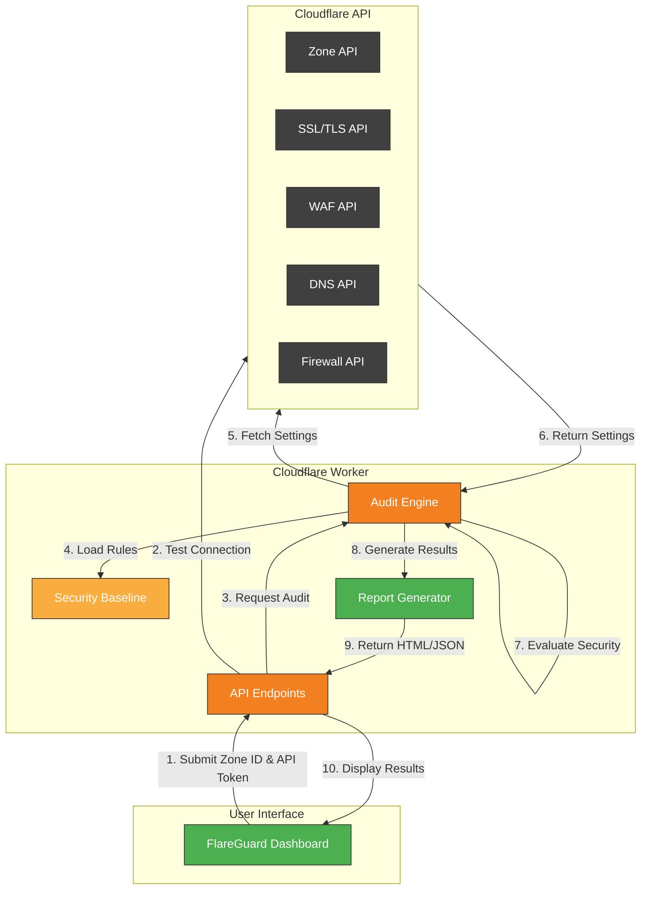

# FlareGuard - Cloudflare Security Auditing Tool

FlareGuard is a security auditing tool for Cloudflare configurations, designed to help organizations ensure their Cloudflare setup follows security best practices. It provides an easy-to-use dashboard for security teams to quickly identify and remediate security issues.

## Overview

FlareGuard runs as a Cloudflare Worker that audits your Cloudflare zone configurations against security best practices. It evaluates settings across multiple security domains including SSL/TLS, WAF, DNS, and Firewall to provide a comprehensive security score and actionable recommendations.

**Dashboard URL:** [https://flareguard.harshad-surfer.workers.dev/](https://flareguard.harshad-surfer.workers.dev/)

## Features

### Zone Security Checks
- SSL/TLS configuration validation
- WAF (Web Application Firewall) setup review
- DNSSEC implementation verification
- Security headers analysis
- Always Use HTTPS enforcement
- Opportunistic Encryption validation
- Browser Integrity Check verification
- Email Obfuscation verification
- Security Level assessment

### Security Scoring
- Overall security score calculation
- Category-based scoring
- Severity-based issue prioritization
- NIST control mapping for compliance

### Reporting
- Interactive web dashboard
- Detailed remediation recommendations
- HTML report generation
- JSON output for integration with other tools

## Architecture

FlareGuard is implemented as a Cloudflare Worker, providing a serverless, globally distributed security auditing solution.



### Components

1. **FlareGuard Worker**: Core serverless application that processes audit requests
2. **Security Baseline**: YAML-defined security rules embedded in the worker
3. **Dashboard UI**: Browser-based interface for interacting with the worker
4. **API Endpoints**:
   - `/audit` - Runs a security audit on a specified zone
   - `/test-connection` - Validates API credentials

## Workflow

```mermaid
flowchart LR
    Start(["Start"]) --> Credentials["Enter Credentials<br/>(Zone ID, API Token)"]
    Credentials --> TestConnection["Test Connection"]
    TestConnection -->|Valid| RunAudit["Run Zone Audit"]
    TestConnection -->|Invalid| Credentials
    
    RunAudit --> FetchSettings["Fetch Zone Settings"]
    FetchSettings --> EvaluateSettings["Evaluate Settings<br/>Against Baseline"]
    
    subgraph BaselineChecks["Security Checks"]
        TLS["TLS/SSL Checks"]
        WAF["WAF Checks"]
        DNS["DNS Checks"]
        Firewall["Firewall Checks"]
        Access["Access Checks"]
    end
    
    EvaluateSettings --> BaselineChecks
    BaselineChecks --> ScoreCalculation["Calculate Security Score"]
    ScoreCalculation --> GenerateReport["Generate Report"]
    GenerateReport --> DisplayResults["Display Results"]
    DisplayResults --> End(["End"])
    
    classDef primary fill:#f38020,stroke:#333,stroke-width:1px,color:white;
    classDef secondary fill:#faad3f,stroke:#333,stroke-width:1px,color:white;
    classDef process fill:#4CAF50,stroke:#333,stroke-width:1px,color:white;
    classDef endpoint fill:#404041,stroke:#333,stroke-width:1px,color:white;
    
    class Start,End endpoint;
    class Credentials,TestConnection,RunAudit,FetchSettings primary;
    class EvaluateSettings,ScoreCalculation,GenerateReport,DisplayResults process;
    class TLS,WAF,DNS,Firewall,Access secondary;
```



The workflow follows these key steps:

1. **Input Credentials**: User provides Zone ID and API Token through the dashboard
2. **Test Connection**: Validates API credentials before proceeding
3. **Fetch Zone Settings**: Retrieves zone configuration via Cloudflare API
4. **Evaluate Security Checks**: Compares settings against security baseline
5. **Generate Report**: Creates an interactive report with findings and recommendations

## Getting Started

### Prerequisites
- Cloudflare account
- Zone ID for the domain you want to audit
- API token with appropriate permissions

### API Token Permissions Required
For zone security auditing:
- Zone Read
- SSL and Certificates Read
- WAF Read
- DNS Read
- Page Rules Read

### Using the Dashboard
1. Navigate to the FlareGuard dashboard at https://flareguard.harshad-surfer.workers.dev/
2. Enter your Cloudflare Zone ID
3. Enter your API token
4. Click "Test Connection" to verify credentials
5. Click "Run Audit" to analyze your zone

### Understanding Results
The dashboard presents results in several sections:
- **Summary**: Overall security score and key metrics
- **Issues**: Detailed list of identified issues sorted by severity
- **Recommendations**: Specific actions to remediate issues
- **Details**: In-depth explanation of each security check

## Security Baseline

FlareGuard evaluates your zone against security best practices including:
- SSL/TLS mode: Full (Strict) recommended
- Minimum TLS version: TLS 1.2 recommended
- Always Use HTTPS: Should be enabled
- Opportunistic Encryption: Should be enabled
- TLS 1.3: Should be enabled
- Browser Integrity Check: Should be enabled
- Email Obfuscation: Should be enabled
- WAF: OWASP Core Rule Set should be enabled
- Security Level: Medium or higher recommended
- Bot Management: Should be enabled to block malicious automated traffic
- DNSSEC: Should be enabled to prevent DNS spoofing attacks

## Implementation Details

FlareGuard is implemented as a Cloudflare Worker, making it easy to deploy and maintain. The security checks are executed directly using the Cloudflare API, ensuring up-to-date and accurate results.

The worker is built using:
- JavaScript
- Cloudflare Workers runtime
- js-yaml for YAML parsing
- Embedded security baseline

## Deployment

FlareGuard is deployed using Wrangler, Cloudflare's CLI tool for Workers:

```bash
wrangler deploy
```

This deploys the worker to your Cloudflare account, making it accessible via your workers.dev subdomain.

## Roadmap

See the [roadmap.md](roadmap.md) file for planned enhancements to FlareGuard.

## License

This project is licensed under the MIT License - see the LICENSE file for details.

## Acknowledgments

- Cloudflare for their excellent API documentation
- The security community for defining best practices

## Contact

For questions or support, please open an issue on GitHub. 