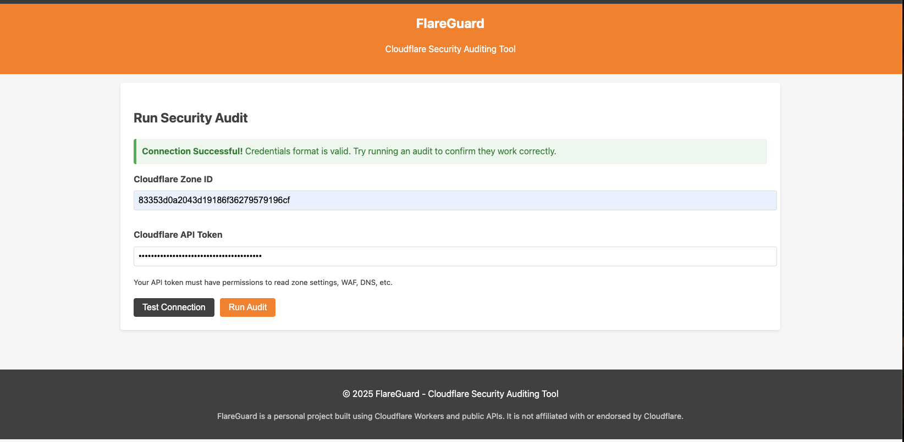
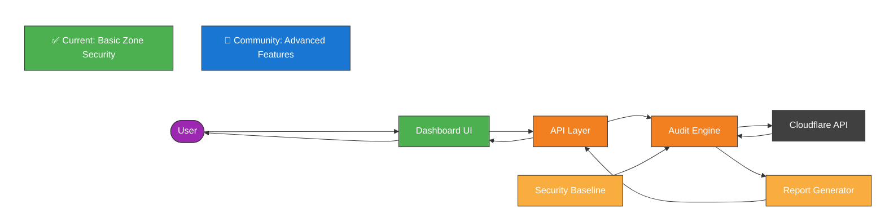

# FlareGuard

> Basic security auditing tool for Cloudflare zone configurations

[](LICENSE)
[]()

FlareGuard is a serverless security auditing tool that helps organizations verify their Cloudflare zone configurations against security best practices. It runs as a Cloudflare Worker, providing a dashboard to identify and remediate security gaps in your Cloudflare setup.

## Current Status

FlareGuard is currently in early development. The core functionality for basic zone security auditing is working, and we're actively expanding capabilities.

### What's Working

- ✅ Basic zone security settings auditing
- ✅ Real-time API integration for core settings
- ✅ Security scoring based on implemented checks
- ✅ Basic remediation guidance
- ✅ NIST controls mapping

### On Our Roadmap (Community Contributions Welcome!)

- 🚀 Advanced security checks (WAF, Rate Limiting, DNSSEC, etc.)
- 🚀 Zero Trust security auditing
- 🚀 Multi-zone support
- 🚀 Historical data tracking

We welcome community contributions to help build these features! See our [Contributing](#contributing) section below.

## Future Vision

Our vision for FlareGuard is to evolve into a comprehensive Cloud Security Posture Management (CSPM) tool for Cloudflare. Check out our [landing page mockup](landing_page_update.html) to see the planned user interface with enhanced features.

### Planned Enhancements

- **Modern Dashboard UI** - Clean, intuitive interface with security score visualization
- **Comprehensive Security Auditing** - Covering Zone Security, Zero Trust, and Multi-Zone management
- **Detailed Reports** - Actionable findings with severity ratings and remediation steps
- **Risk Prioritization** - Focus on critical issues first with clear impact assessments
- **Tabbed Interface** - Easy navigation between different security aspects

This vision represents where we're heading, and we welcome community contributions to help make it a reality!

## How It Works

FlareGuard provides a simple workflow to audit your Cloudflare zone security settings. The screenshots below show the web interface in action.

> **Security Note:** When using FlareGuard or sharing screenshots, always redact sensitive information like Zone IDs, API tokens, and domain names. The screenshots below are examples only and should not contain real credentials.
> 
> **Important:** Before sharing any screenshots of your FlareGuard usage:
> 1. Redact or blur all Zone IDs (32-character hexadecimal strings)
> 2. Never include API tokens in screenshots
> 3. Consider redacting domain names if they're for internal or sensitive systems
> 4. Verify no sensitive information appears in the URL bar or browser tabs

### 1. Enter Credentials

Enter your Cloudflare Zone ID and API Token to begin the security audit.


### 2. Test Connection

Test the connection to ensure your credentials are valid and have the required permissions.



### 3. Run Audit

Run the security audit to evaluate your zone against security best practices.


### 4. View Results

Review the detailed results showing passed and failed checks, with remediation guidance.


## Latest Updates

- **Real-time API Integration**: Now fetches live data from the Cloudflare API for basic zone settings
- **Improved Accuracy**: Security audit results now accurately reflect your actual Cloudflare configuration
- **Fixed Function Name Collision**: Resolved issues with global fetch function for better reliability
- **Optimized Deployment**: Removed unnecessary KV namespace dependencies for smoother deployment

## Features

- 🔍 **Basic Security Gap Analysis** - Scans Cloudflare zone configurations for security gaps
- 🔐 **Configurable Baselines** - Compares settings against YAML-defined security baselines
- 📊 **Security Scoring** - Calculates overall security score with detailed breakdowns
- 🏢 **Compliance Mapping** - Maps findings to NIST security controls
- 📝 **Remediation Guidance** - Provides actionable recommendations for each issue
- 🔄 **Real-time Analysis** - Connects directly to Cloudflare API for up-to-date results
- 🌐 **Serverless Architecture** - Runs entirely as a Cloudflare Worker with no backend servers

## Architecture



## Getting Started

### Prerequisites

- [Cloudflare](https://cloudflare.com) account
- [Wrangler CLI](https://developers.cloudflare.com/workers/wrangler/install-and-update/) (for deployment)
- Node.js (v16+)

### Installation

1. Clone the repository
   ```bash
   git clone https://github.com/harshadk99/flareguard.git
   cd flareguard
   ```

2. Install dependencies
   ```bash
   npm install
   ```

3. Deploy to Cloudflare Workers
   ```bash
   wrangler deploy
   ```

## Usage

### Quick Start

1. Enter your Cloudflare Zone ID
2. Enter your Cloudflare API Token with appropriate permissions
3. Click "Test Connection" to verify credentials
4. Click "Run Audit" to analyze your zone

### Required API Token Permissions

Your Cloudflare API token needs these permissions:
- Zone Read
- SSL and Certificates Read

### Understanding Results

The audit provides results in several sections:
- **Summary** - Overall security score and statistics
- **Issue List** - Detailed findings sorted by severity
- **Remediation** - Specific recommendations to improve security

## Security & Privacy

**FlareGuard prioritizes your security and privacy:**

- No credentials or sensitive data are stored
- All processing happens at request time in the Cloudflare Worker
- API tokens are only used for the duration of the audit
- No data is logged or persisted after the audit completes
- Uses `type="password"` fields to protect token visibility

## Security Checks Currently Implemented

FlareGuard currently evaluates your zone against these security best practices:

| Check | Recommendation | NIST Controls |
|-------|----------------|---------------|
| SSL/TLS Mode | Full (Strict) | SC-8, SC-12 |
| Minimum TLS Version | TLS 1.2+ | SC-8, SC-13 |
| Always Use HTTPS | Enabled | SC-8, SC-7 |
| Opportunistic Encryption | Enabled | SC-8 |
| TLS 1.3 | Enabled | SC-8, SC-13 |
| Browser Integrity Check | Enabled | SI-3 |
| Email Obfuscation | Enabled | SC-18 |
| Security Level | Medium+ | SC-5 |

## Security Checks for Community Development

We welcome community contributions to implement these additional security checks:

| Check | Recommendation | NIST Controls | Difficulty |
|-------|----------------|---------------|------------|
| WAF Core Rule Set | Enabled | SC-7, SI-4 | Medium |
| Bot Management | Enabled | SC-5, SI-4 | Medium |
| DNSSEC | Enabled | SC-8, SC-20 | Easy |
| Rate Limiting | Configured | SC-5, SI-4 | Medium |
| WAF Logging | Enabled | AU-2, AU-11 | Easy |
| Country Blocking | Configured | AC-3, SC-7 | Medium |
| Certificate Expiration | >30 days | SC-12, CM-6 | Easy |
| Strong Cipher Suites | No weak ciphers | SC-8, SC-13 | Medium |

See our [roadmap.md](roadmap.md) for more details on how you can contribute to these features.

## Contributing

We welcome and encourage contributions from the community! FlareGuard is an open-source project with many exciting opportunities for enhancement.

### Ways to Contribute

- **Implement New Security Checks**: Add one of the security checks from our community development list
- **Improve Documentation**: Enhance the docs, add examples, or clarify instructions
- **Fix Bugs**: Help us identify and fix issues
- **Add Features**: Implement new features from our roadmap
- **Suggest Ideas**: Open an issue with your feature suggestions

### Contribution Process

1. **Fork the repository**
2. **Create a feature branch**
   ```bash
   git checkout -b feature/amazing-feature
   ```
3. **Commit your changes**
   ```bash
   git commit -m 'Add some amazing feature'
   ```
4. **Push to the branch**
   ```bash
   git push origin feature/amazing-feature
   ```
5. **Open a Pull Request**

### Getting Help

- Check our [roadmap.md](roadmap.md) for detailed development plans
- Open an issue to discuss your ideas before starting development
- Join our community discussions in the Issues section

For major changes, please open an issue first to discuss what you'd like to change.

## Roadmap

See the [roadmap.md](roadmap.md) file for planned enhancements.

## License

This project is licensed under the MIT License - see the [LICENSE](LICENSE) file for details.

## Acknowledgments

- Cloudflare for their excellent API documentation
- The security community for defining best practices
- All contributors who help improve this tool 

## Testing with Environment Variables

For local testing and development, you can use environment variables to securely store your Cloudflare credentials:

1. **Set up your environment variables**:
   ```bash
   npm run setup:env
   ```
   This interactive script will prompt you for your Cloudflare Zone ID and API Token and store them in a `.env` file.

2. **Run the test with environment variables**:
   ```bash
   npm run test:env
   ```

The `.env` file is automatically added to `.gitignore` to prevent accidentally committing your credentials to the repository. 