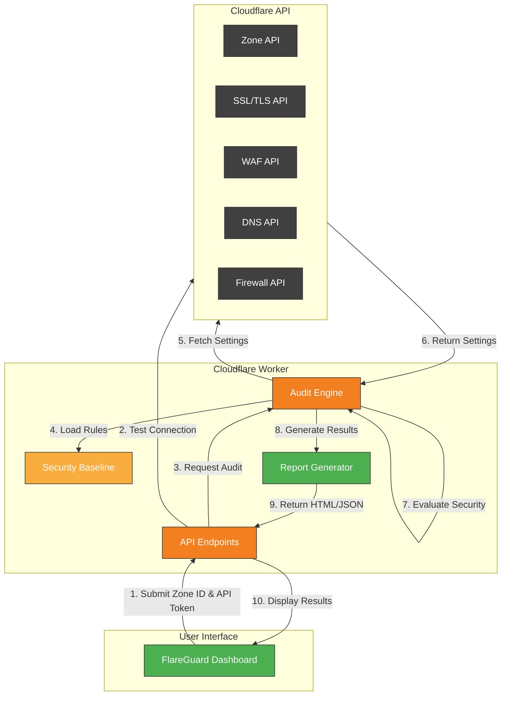

# FlareGuard

> Comprehensive security auditing tool for Cloudflare configurations

[](https://flareguard.harshad-surfer.workers.dev)
[](LICENSE)
[]()

FlareGuard is a serverless security auditing tool that helps organizations verify their Cloudflare configurations against security best practices. It runs as a Cloudflare Worker, providing a user-friendly dashboard to identify and remediate security gaps in your Cloudflare setup.

## Screenshot


## Features

- 🔍 **Security Gap Analysis** - Scans Cloudflare zone configurations for security gaps
- 🔐 **Configurable Baselines** - Compares settings against YAML-defined security baselines
- 📊 **Security Scoring** - Calculates overall security score with detailed breakdowns
- 🏢 **Compliance Mapping** - Maps findings to NIST security controls
- 📝 **Remediation Guidance** - Provides actionable recommendations for each issue
- 🔄 **Real-time Analysis** - Connects directly to Cloudflare API for up-to-date results
- 🌐 **Serverless Architecture** - Runs entirely as a Cloudflare Worker with no backend servers

## Architecture



## Getting Started

### Prerequisites

- [Cloudflare](https://cloudflare.com) account
- [Wrangler CLI](https://developers.cloudflare.com/workers/wrangler/install-and-update/) (for deployment)
- Node.js (v16+)

### Installation

1. Clone the repository
   ```bash
   git clone https://github.com/harshadk99/flareguard.git
   cd flareguard
   ```

2. Install dependencies
   ```bash
   npm install
   ```

3. Deploy to Cloudflare Workers
   ```bash
   wrangler deploy
   ```

## Usage

### Quick Start

1. Visit the [FlareGuard Dashboard](https://flareguard.harshad-surfer.workers.dev/)
2. Enter your Cloudflare Zone ID
3. Enter your Cloudflare API Token with appropriate permissions
4. Click "Test Connection" to verify credentials
5. Click "Run Audit" to analyze your zone

### Required API Token Permissions

Your Cloudflare API token needs these permissions:
- Zone Read
- SSL and Certificates Read
- WAF Read
- DNS Read
- Page Rules Read

### Understanding Results

The audit provides results in several sections:
- **Summary** - Overall security score and statistics
- **Issue List** - Detailed findings sorted by severity
- **Remediation** - Specific recommendations to improve security

## Security & Privacy

**FlareGuard prioritizes your security and privacy:**

- No credentials or sensitive data are stored
- All processing happens at request time in the Cloudflare Worker
- API tokens are only used for the duration of the audit
- No data is logged or persisted after the audit completes
- Uses `type="password"` fields to protect token visibility

## Security Checks

FlareGuard evaluates your zone against these security best practices:

| Check | Recommendation | NIST Controls |
|-------|----------------|---------------|
| SSL/TLS Mode | Full (Strict) | SC-8, SC-12 |
| Minimum TLS Version | TLS 1.2+ | SC-8, SC-13 |
| Always Use HTTPS | Enabled | SC-8, SC-7 |
| Opportunistic Encryption | Enabled | SC-8 |
| TLS 1.3 | Enabled | SC-8, SC-13 |
| Browser Integrity Check | Enabled | SI-3 |
| Email Obfuscation | Enabled | SC-18 |
| WAF Core Rule Set | Enabled | SC-7, SI-4 |
| Security Level | Medium+ | SC-5 |
| Bot Management | Enabled | SC-5, SI-4 |
| DNSSEC | Enabled | SC-8, SC-20 |

## Contributing

Contributions are welcome! Here's how you can help:

1. **Fork the repository**
2. **Create a feature branch**
   ```bash
   git checkout -b feature/amazing-feature
   ```
3. **Commit your changes**
   ```bash
   git commit -m 'Add some amazing feature'
   ```
4. **Push to the branch**
   ```bash
   git push origin feature/amazing-feature
   ```
5. **Open a Pull Request**

For major changes, please open an issue first to discuss what you'd like to change.

## Roadmap

See the [roadmap.md](roadmap.md) file for planned enhancements.

## License

This project is licensed under the MIT License - see the [LICENSE](LICENSE) file for details.

## Acknowledgments

- Cloudflare for their excellent API documentation
- The security community for defining best practices
- All contributors who help improve this tool 